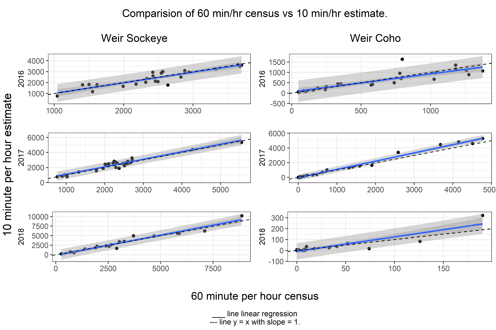
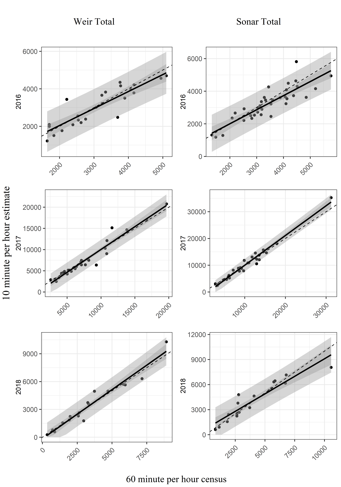

Authors: Birch Foster & Sarah Power

```{r set-options, echo=FALSE, message=FALSE}


# set the base directory

knitr::opts_knit$set(root.dir = normalizePath(".."))

getwd()
# Libraries/themes

source("../code/functions.r")
library(kableExtra)
library(mosaic)

# Data  ----

# table_values

load(file = "../output/table_values_1060.Rda")
table_values <- table_values_1060

```


# Introduction

(Birch to re/write.)
It is often the practice to count the passage of anadromous fish escaping to a river for 10 minutes of each hour and expand that count by 6 in order to estimate the entire hours passage of fish. This study examines the assumption that a 10-minute expanded count can represent a 60-minute census.
The study takes place on the Chignik River in Alaska during 2014 to 2016, for several weeks in August and September. During this time period Sockeye (*Oncorhynchus nerka*) and coho (*Oncorhynchus kisutch*) are abundant and during odd years so are pink (Oncorhyncus gorbuscha). During this time period there may be some less abundant Dolly Varden (*Salvelinus malma*) as well as chum (*Oncorhynchus keta*) & Chinook (*Oncorhynchus tshawytscha*) that are coming in at the tail end of their runs. For our study we will examine the relationship with sockeye, coho, and the total of all fish, regardless of species for weirs and the total of all fish for the sonar.
For this study there were two enumeration points that the fish could cross, either a weir or a sonar. During 2016 the sonar was located a upstream of the weir. This location was not ideal as there was question as to whether the site in question was optimal for a sonar due to milling. The sonar was moved closer to the weir in 2017-2018.
In order to study the 10-minute-estimate to 60-minute-cesus relationship several factors were taken accounted for. Those included, year, species, (or total of all species combined), and method of enumeration, namely video weir or sonar. 

# Methods
(Birch to write, some details added here:)
For the sonar only the total of all species combined was compared since species apportionment comes from seining the river every 4 days or so.
The hourly estimates or counts were summed for each day. 

# Analysis
(Birch to edit)
There were 12 census to estimate relationships examined. For the weir there was sockeye, coho, and total fish passage. For the sonar there was total fish passage. So that makes a total of 4 species or species groupings, each which were examined for the 2014-2016 years.
A linear regression between the independent variable, 60-minute counts, and the dependent variable, 10-minute estimates, was produced. (Figures 1 & 2) Since some of the residuals appeared to be not independently and identically distributed, we used the non-parametric Wilcoxon rank sum test to examine the relationships first. Because we are testing 12 hypotheses, the Bonferroni correction for an alpha of 0.05 is 0.05/12, approximately 0.004.
Our null hypothesis is that the 60-minute count and the 10-minute estimate of fish passage are equivalent, the alternative is that they are not. In each of the 12 cases we fail to reject the null hypothesis. (Table 1, column Wilcoxon)
For 8 of the 12 cases the data is normally distributed and hypothesis testing on the linear regression is appropriate. (Table 1, column Shapiro).  Here the Bonferroni correction is 0.05/8 = 0.00625. All regressions were statistically significant with p values < 0.001 (Table 1, column lm). In order to test if estimates and census counts were equivalent our null hypothesis was that the regression's slope was equivalent to 1, our alternative hypothesis was that it was not. In all 8 cases we fail to reject the null hypothesis. (Table 1, column slope_eq1).
Conclusion
An expanded 10 minutes per hour count is appropriate for estimating the 60 minute census, and at a fraction of the cost of doing a census. 

#Tables


```{r my_table, echo=FALSE, message=FALSE, warning=FALSE}

# The p-values need to be divided by the number of valid tests (Bonferroni
# correction)
n_wilcox <- length(which(is.na(table_values$wilcox) == FALSE))
n_normal <- length(which(is.na(table_values$slope_eq1) == FALSE))


# Format sig figs
table_values[c(4, 5, 6, 7)] <- lapply(table_values[,c(4, 5, 6, 7)], formatC,  format="f", digits = 3) #add in lm column
table_values$adj_r_squared <- formatC(table_values$adj_r_squared, format="f", digits = 2)

table_values <- table_values %>%
  mutate(species = derivedVariable("Coho" = species == "coho",
                                   "Sockeye" = species == "sockeye",
                                   "Total" = species == "total"),
         method = derivedVariable("Weir" = method == "weir",
                                   "Sonar" = method == "sonar"),
         # Bold values that are significant
         wilcox = ifelse(as.numeric(wilcox) < 0.05/n_wilcox, paste0("**", wilcox, "**"), wilcox),
         shapiro = ifelse(as.numeric(shapiro) < 0.05, paste0("**", shapiro, "**"), shapiro),
         lm = ifelse(as.numeric(lm) < 0.05/n_normal, paste0("**", lm, "**"), lm),
         slope_eq1 = ifelse(as.numeric(slope_eq1) < 0.05/n_normal, paste0("**", slope_eq1, "**"), slope_eq1))

table_values[table_values == "  NA"] <- " "
table_values[table_values == " NA"] <- " "
table_values[is.na(table_values)] <- " "

table_values[table_values == "**0.000**"] <- "**< 0.001**"

colnames(table_values) <- c("Species", "Method", "Year", "Wilcoxon", "Linear Reg", "Shapiro", "Slope = 1", "Adj $R^2$")

kable(table_values, align = c('l', 'l', 'r', 'r', 'r', 'r', 'r', 'r'))


# unique(table_values$adj_r_squared)
```
\pagebreak
# Figures
<p>

</p>


\pagebreak
<p>

</p>


