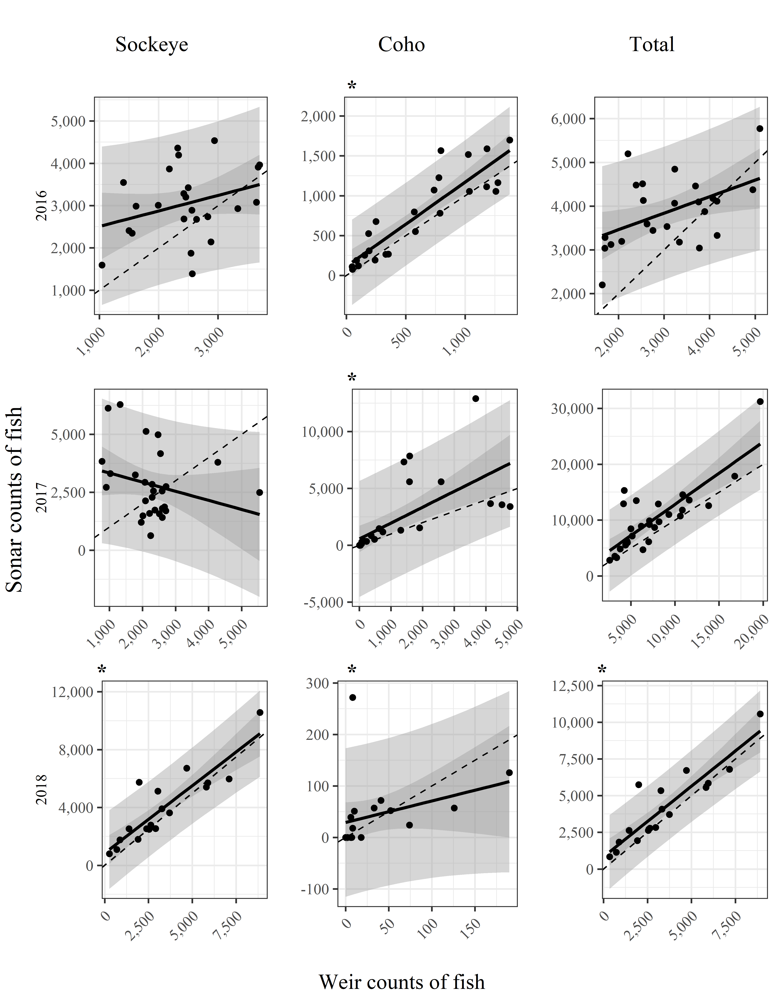

Authors: Birch Foster & Sarah Power

```{r set-options, echo=FALSE, message=FALSE}


# set the base directory

knitr::opts_knit$set(root.dir = normalizePath(".."))


# Libraries/themes

source("../code/functions.r")
library(kableExtra)
library(mosaic)

# Data  ----

# table_values

load(file = "../output/table_values_ws.Rda")
table_values <- table_values_ws
```


# Introduction

(Birch to re/write.)
It is often the practice to count the passage of anadromous fish escaping to a river either by sonar or weir. Where both methods may be used on a single river system it is necessary to understand how the two methods compare. Those instances may arise when a weir fails to be fish tight and uses sonar as a back up; or where one method is used during some number of seasons and another method is used during other seasons.

Other studies have examined this realtionship (cite here). This study is unique because it is comprised of a complete census^[There are instances of sonar failure. The percentage of footage per day is noted in appendix XX, but these instances account for a small portion of the entire time period.] of the two methods during several weeks for three years. While other studies compare the two estimates estimaes are usually made with only a portion of counts every hour. (cite studies where this is the case.)

The study also takes into account species composition via the two methods. For the weir, which has video monitors, species compostion is done via sight. For the sonar, species compostion is done a few times a week when fish are seined to the riverbank. While we could have just compared total fish counted to compare the two numbers we also wanted to understand how variation in methods of species apportionment might affect the relationships. 

The study takes place on the Chignik River in Alaska during 2014 to 2016, for several weeks in August and September. During this time period Sockeye (*Oncorhynchus nerka*) and coho (*Oncorhynchus kisutch*) are abundant and during odd years so are pink (Oncorhyncus gorbuscha). During this time period there may be some less abundant Dolly Varden (*Salvelinus malma*) as well as chum (*Oncorhynchus keta*) & Chinook (*Oncorhynchus tshawytscha*) that are coming in at the tail end of their runs. For our study we will examine the relationship with sockeye, coho, and the total of all fish, regardless of species for weirs and the total of all fish for the sonar.

For this study fish crossed the weir before the sonar sonar. During 2016 the sonar was located a upstream of the weir. This location was not ideal as there was question as to whether the site in question was optimal for a sonar due to fish milling back and forth. The sonar was moved closer to the weir in 2017-2018.


# Methods
(Birch to write, some details added here:)
A weir is operated on Chignik from approximately X to Y each year. In addition to the in season estimation of fish passage avideo weir recorded fish passage from the begining of August to late September during the 2016 - 2018 years.(Cite table with dates) This footage was examined post season during the years ??. Species composition was determined by sight. 

A sonar was operated from approximately August to late Spetember during the 
The sonar was operated during a shorter time period than the weir from approximately the beginning of August to late September each year. (Cite table with dates) This footage is examined post season during the years ??. Species composition was determined by seining the river approximately every 4 days and estimating species apportionment from those hauls.

# Analysis
(Birch to edit)
There were 9 relationships examined. There were two species, sockeye and coho, as well as the total of all species, including non-sockeye and non-coho, which gave three species groupings, and for each of those we analyzed three years. 
A linear regression between  weir counts and sonar counts was produced. (Figure 1) Since some of the residuals appeared to be not independently and identically distributed, we used the non-parametric Wilcoxon rank sum test to examine the relationships first. Because we were testing 9 hypotheses, the Bonferroni correction for an alpha of 0.05 is 0.05/9, approximately 0.005.
Our null hypothesis is that weir and sonar enumeration of fish passage is equivalent, the alternative is that they are not. In 3 of the 9 cases we fail to reject the null hypothesis. (Table 1, column Wilcoxon)
For 4 of the 9 cases the data is normally distributed and hypothesis testing on the linear regression is appropriate. (Table 1, column Shapiro). Only 2 of those 4 regressions were statistically significant with p values <= 0.02.  WE used the Bonferroni correction is 0.05/4 approximately 0.013 for futher testing. For the 2 regressions that were significant we tested the equivalency of sonar and wier counts with a null hypothesis was that the regression's slope was equivalent to 1, our alternative hypothesis was that it was not. In one case we failed to reject the null hypothesis. (Table 1, column slope_eq1).
# Discussion
The sonar to weir relationship is not consistent.
In lieu of other data the sonar may be used as a back up, more examination of the data may be conducted to understand why in some instances the relationship is poor or even negatively related (sockeye 2017). Further examintions of river height may be conducted in the future.

#Tables

```{r my_table, echo=FALSE, message=FALSE, warning=FALSE}

# The p-values need to be divided by the number of valid tests (Bonferroni
# correction)
n_wilcox <- length(which(is.na(table_values$wilcox) == FALSE))
n_normal <- length(which(is.na(table_values$slope_eq1) == FALSE))

# Format sig figs
table_values[c(4,5,6,7)] <- lapply(table_values[,c(4,5,6,7)], formatC,  format="f", digits = 3)
table_values$adj_r_squared <- formatC(table_values$adj_r_squared, format="f", digits = 2)

table_values <- table_values %>%
  mutate(species = derivedVariable("Coho" = species == "coho",
                                   "Sockeye" = species == "sockeye",
                                   "Total" = species == "total"),
         period = derivedVariable("60 min./hr." = period == "sixty_minute",
                                   "Estimate" = period == "ten_minute"),
         # Bold values that are significant
         wilcox = ifelse(as.numeric(wilcox) < 0.05/n_wilcox, paste0("**", wilcox, "**"), wilcox),
         shapiro = ifelse(as.numeric(shapiro) < 0.05, paste0("**", shapiro, "**"), shapiro),
         lm = ifelse(as.numeric(lm) < 0.05/n_normal, paste0("**", lm, "**"), lm),
         slope_eq1 = ifelse(as.numeric(slope_eq1) < 0.05/n_normal, paste0("**", slope_eq1, "**"), slope_eq1))

table_values[table_values == "  NA"] <- " "
table_values[table_values == " NA"] <- " "
table_values[is.na(table_values)] <- " "

table_values[table_values == "**0.000**"] <- "**< 0.001**"

colnames(table_values) <- c("Species", "Period", "Year", "Wilcoxon","Shapiro",  "Linear Reg", "Slope = 1", "Adj $R^2$")

kable(table_values, align = c('l', 'l', 'r', 'r', 'r', 'r', 'r', 'r'))


# unique(table_values$adj_r_squared)
```
\pagebreak
# Figures

<p>

</p>

